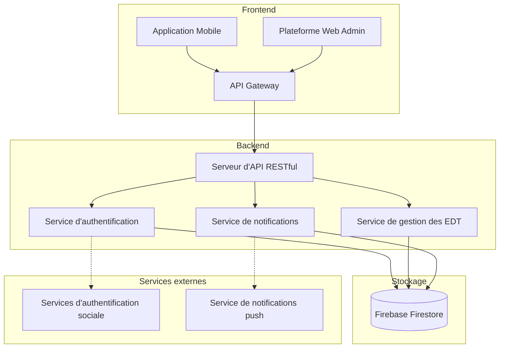
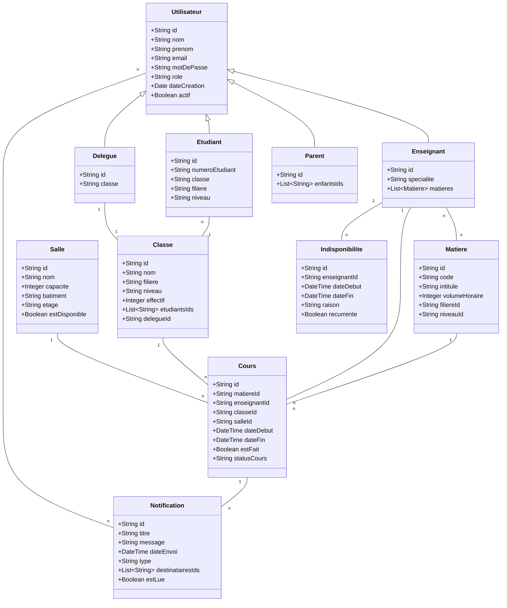
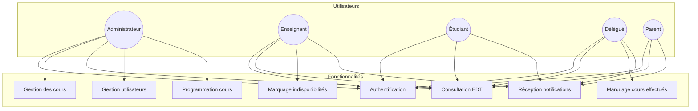
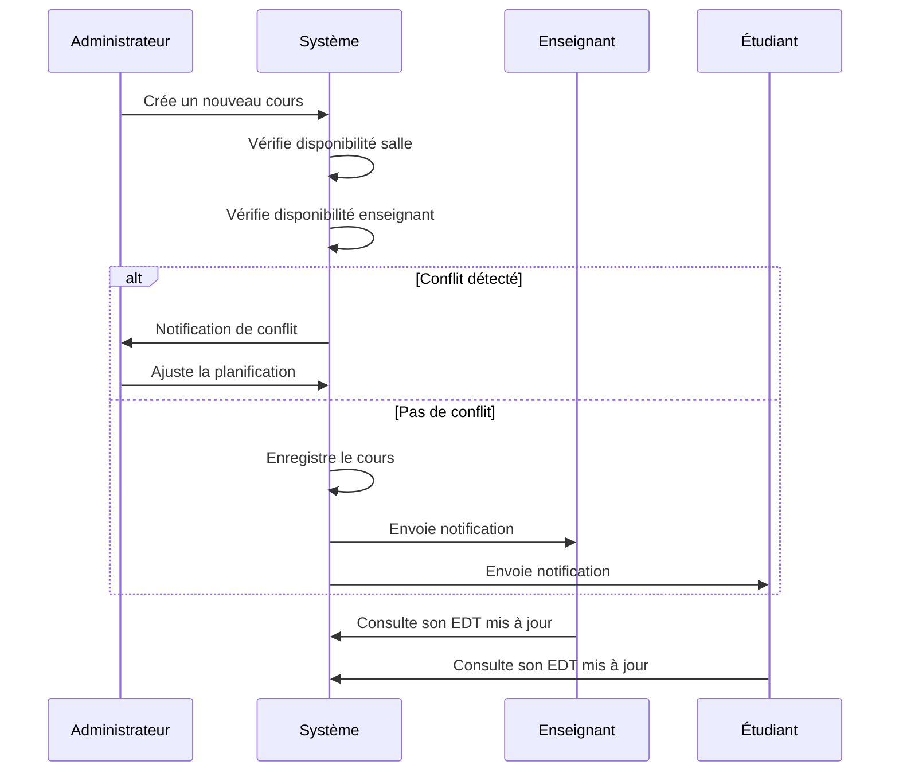

Je vais vous proposer une analyse des besoins et une conception détaillée pour ce projet d'application de gestion des emplois du temps à l'IBAM.

# Analyse des besoins

## 1. Contexte et objectifs

Le projet vise à développer une application mobile pour la gestion des emplois du temps à l'IBAM avec deux composantes :

- Une plateforme web administrative pour la gestion des EDT selon les disponibilités des enseignants
- Une application mobile permettant aux enseignants et étudiants de consulter leur emploi du temps hebdomadaire

## 2. Parties prenantes

- **Administration** : Gestion globale des emplois du temps
- **Enseignants** : Consultation des EDT et marquage des indisponibilités
- **Étudiants** : Consultation des EDT
- **Délégués** : Fonctionnalités supplémentaires (marquer les cours effectués)
- **Parents d'étudiants** : Consultation des EDT de leurs enfants

## 3. Exigences fonctionnelles

### Système d'authentification

- Inscription et connexion par email/mot de passe
- Authentification via réseaux sociaux
- Gestion des rôles et autorisations (admin, enseignant, étudiant, délégué, parent)

### Gestion des cours

- CRUD complet pour les cours
- Programmation des cours avec créneaux (8h-12h ou 14h-18h) et salles
- Gestion des emplois du temps hebdomadaires

### Gestion des disponibilités

- Interface pour les enseignants pour indiquer leurs indisponibilités
- Système d'alerte pour les conflits de planning

### Suivi des cours

- Fonctionnalité pour les délégués de marquer les cours comme effectués
- Historique des cours passés

### Notifications

- Rappels pour les cours à venir
- Alertes pour les annulations ou changements de salle
- Notifications pour les modifications d'emploi du temps

### Interfaces utilisateur

- Interface admin web pour la gestion globale
- Interfaces mobiles spécifiques pour chaque type d'utilisateur

## 4. Exigences non fonctionnelles

- **Performance** : Application fluide, temps de réponse rapide
- **Sécurité** : Protection des données, authentification sécurisée
- **Maintenabilité** : Code bien structuré, documentation complète
- **Disponibilité** : Accès continu au service
- **Convivialité** : Interface intuitive et ergonomique

# Conception du système

## 1. Architecture globale

## 2. Modèle de données

## 3. Diagramme des cas d'utilisation

## 4. Descriptions des interfaces utilisateur

### Interface d'administration (Web)

- **Dashboard** : Vue d'ensemble avec statistiques et alertes
- **Gestion des utilisateurs** : CRUD pour tous les types d'utilisateurs
- **Planification des EDT** : Interface de type calendrier avec drag-and-drop
- **Gestion des salles** : Vue d'occupation et disponibilité
- **Gestion des matières** : Association avec enseignants et classes
- **Rapports** : Statistiques d'utilisation et d'occupation

### Interface mobile (Enseignants)

- **Vue EDT personnelle** : Calendrier hebdomadaire des cours
- **Gestion des indisponibilités** : Interface pour marquer les périodes d'indisponibilité
- **Historique des cours** : Liste des cours passés et à venir
- **Notifications** : Centre de notification pour les changements

### Interface mobile (Étudiants)

- **EDT de classe** : Calendrier hebdomadaire des cours
- **Détails des cours** : Informations sur l'enseignant, la salle, etc.
- **Notifications** : Alertes pour changements et annulations

### Interface mobile (Délégués)

- Toutes les fonctionnalités des étudiants, plus :
- **Marquage des cours** : Interface pour indiquer si un cours a été effectué
- **Rapports** : Possibilité de remonter des informations à l'administration

### Interface mobile (Parents)

- **EDT des enfants** : Visualisation des emplois du temps
- **Historique** : Suivi des cours passés et à venir
- **Notifications** : Alertes pour les changements importants

## 5. Flux de travail principaux

## 6. Plan d'implémentation et technologies

### Frontend

- **Mobile** : Framework multiplateforme (Flutter ou React Native)
- **Web Admin** : React.js avec Material-UI ou Angular

### Backend

- **API RESTful** : Node.js avec Express ou Django
- **Authentification** : Firebase Authentication
- **Base de données** : Firebase Firestore
- **Stockage** : Firebase Storage (pour documents et médias)

### Services annexes

- **Notifications push** : Firebase Cloud Messaging
- **Analytics** : Firebase Analytics
- **Déploiement** : CI/CD avec GitHub Actions

## 7. Calendrier de développement (6 semaines)

1. **Semaine 1** :

   - Configuration de l'environnement de développement
   - Mise en place de la base de données
   - Implémentation de l'authentification

2. **Semaine 2** :

   - Développement des API backend pour la gestion des cours
   - Création des interfaces utilisateur de base

3. **Semaine 3** :

   - Implémentation de la gestion des EDT
   - Développement des interfaces spécifiques par rôle

4. **Semaine 4** :

   - Intégration des notifications
   - Développement des fonctionnalités spécifiques (indisponibilités, marquage)

5. **Semaine 5** :

   - Tests d'intégration
   - Correction des bugs
   - Optimisation des performances

6. **Semaine 6** :
   - Finalisation et documentation
   - Préparation de la démonstration
   - Déploiement de la version finale

## 8. Fonctionnalités innovantes (optionnelles)

1. **EDT intelligent** :

   - Suggestion automatique de planification basée sur l'historique
   - Détection intelligente des conflits et proposition d'alternatives

2. **Commandes vocales** :

   - Intégration de la reconnaissance vocale pour naviguer dans l'application
   - Possibilité de demander "Quel est mon prochain cours ?" ou "Suis-je disponible jeudi après-midi ?"

3. **Analyse prédictive** :

   - Prédiction des taux d'occupation des salles
   - Identification des périodes à forte/faible charge

4. **Interface interactive** :
   - Visualisation 3D des bâtiments et salles
   - Guidage vers les salles de cours

Souhaitez-vous que je développe davantage certains aspects de cette analyse et conception ?
